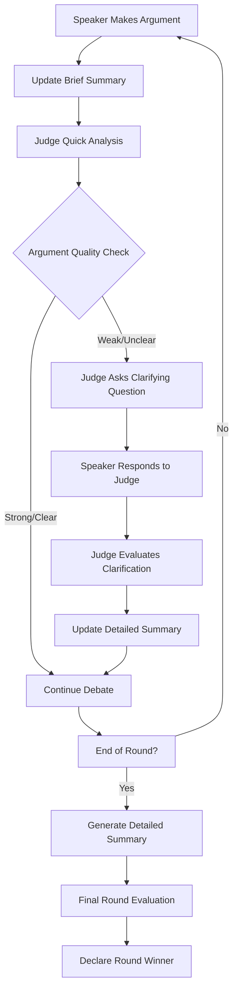

# Interactive Judge System - Implementation Plan

## Overview
Transform the current static judge system into an interactive one that can ask clarifying questions when detecting weak arguments, while optimizing for speed through multi-level conversation summarization.

## Key Requirements
1. **Interactive Judging**: Judge can ask clarifying questions to debaters
2. **Smart Intervention**: Only intervene when detecting weak or unclear arguments
3. **Multi-Level Summarization**: Brief summaries for quick decisions, detailed for final evaluations
4. **Speed Optimization**: Reduce processing time through intelligent context management
5. **Maintain Quality**: Keep evaluation standards high while being faster

## System Architecture



## Core Components

### 1. Multi-Level Summarization System
- **Brief Summaries**: 1-2 sentences per speaker per round for quick decisions
- **Detailed Summaries**: Comprehensive analysis for final evaluations
- **Rolling Updates**: Summaries updated after each significant exchange
- **Context Compression**: Maintain debate essence while reducing token count

### 2. Interactive Judge Controller
- **Quick Argument Analyzer**: Fast heuristic-based screening for weak arguments
- **Intervention Trigger**: Detect unclear reasoning, missing evidence, or logical gaps
- **Question Generator**: Create targeted clarifying questions
- **Response Evaluator**: Assess quality of clarifications

### 3. Speed Optimization Engine
- **Smart Context Management**: Use summaries instead of full conversation history
- **Parallel Processing**: Analyze arguments while next speaker prepares
- **Cached Patterns**: Pre-defined weak argument indicators
- **Optimized Prompts**: Focused, specific evaluation criteria

### 4. Enhanced Judge Personality
- **Professional Questioning**: Engaging but respectful intervention style
- **Quick Decision Making**: Fast evaluation with clear reasoning
- **Adaptive Behavior**: Learn when interventions are most effective

## Technical Implementation

### Phase 1: Summarization System
1. **Create SummaryManager Class**
   - Brief summary generation (50-100 words)
   - Detailed summary generation (200-300 words)
   - Rolling update mechanism
   - Context compression algorithms

2. **Integration with Debate Flow**
   - Hook into existing conversation history
   - Update summaries after each speaker
   - Provide summaries to judge on demand

### Phase 2: Interactive Judge System
1. **Modify Judge Class**
   - Add intervention capabilities
   - Implement quick analysis method
   - Create question generation system
   - Add clarification response handling

2. **Argument Quality Detection**
   - Keyword-based weak argument detection
   - Length and structure analysis
   - Logical consistency checking
   - Evidence quality assessment

### Phase 3: Integration and Optimization
1. **Flow Controller Updates**
   - Integrate judge interventions into debate flow
   - Handle clarification rounds
   - Manage timing and pacing

2. **Performance Optimization**
   - Benchmark current vs. new system
   - Fine-tune summarization algorithms
   - Optimize prompt engineering
   - Implement caching strategies

## Implementation Details

### Summarization Strategy
```python
class SummaryManager:
    def __init__(self):
        self.brief_summaries = {}  # {round: {speaker: brief_summary}}
        self.detailed_summaries = {}  # {round: detailed_summary}
    
    def update_brief_summary(self, speaker, content, round_num):
        # Generate 1-2 sentence summary of speaker's key points
        pass
    
    def generate_detailed_summary(self, round_num):
        # Create comprehensive round summary for final evaluation
        pass
    
    def get_context_for_judge(self, decision_type):
        # Return appropriate summary level based on decision type
        pass
```

### Interactive Judge Logic
```python
class InteractiveJudge:
    def analyze_argument_quality(self, argument, brief_context):
        # Quick analysis using brief summaries
        # Return: needs_clarification, confidence_score
        pass
    
    def generate_clarifying_question(self, argument, weakness_type):
        # Create targeted question based on detected weakness
        pass
    
    def evaluate_clarification(self, original_argument, clarification):
        # Assess if clarification adequately addresses weakness
        pass
```

### Intervention Triggers
- **Missing Evidence**: Claims without supporting examples
- **Logical Gaps**: Conclusions that don't follow from premises
- **Unclear Reasoning**: Confusing or contradictory statements
- **Weak Connections**: Poor engagement with other participants' points
- **Vague Language**: Overly general or ambiguous statements

## Performance Targets
- **Intervention Decision**: < 2 seconds (using brief summaries)
- **Question Generation**: < 3 seconds
- **Context Processing**: 60-70% reduction in tokens through summarization
- **Overall Speed**: 40-50% faster than current system
- **Quality Maintenance**: No degradation in evaluation accuracy

## Benefits
1. **Higher Quality Debates**: Weak arguments get strengthened through clarification
2. **Faster Processing**: Multi-level summaries dramatically reduce context size
3. **More Engaging**: Interactive elements keep debaters sharp and focused
4. **Better Evaluation**: Judge has clearer understanding before final scoring
5. **Scalable**: System can handle longer debates without performance degradation

## Testing Strategy
1. **Unit Tests**: Individual components (summarization, question generation)
2. **Integration Tests**: Full debate flow with interventions
3. **Performance Tests**: Speed comparisons with current system
4. **Quality Tests**: Evaluation accuracy with and without interventions
5. **User Experience Tests**: Debater satisfaction with interactive elements

## Future Enhancements
- **Machine Learning**: Learn optimal intervention patterns
- **Multiple Question Types**: Different styles for different weaknesses
- **Adaptive Thresholds**: Adjust intervention frequency based on debate quality
- **Real-time Feedback**: Continuous quality scoring during debates