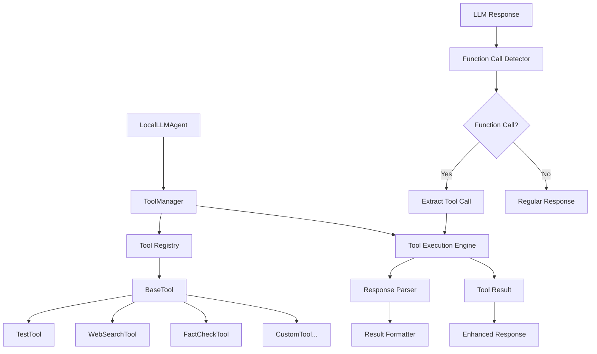
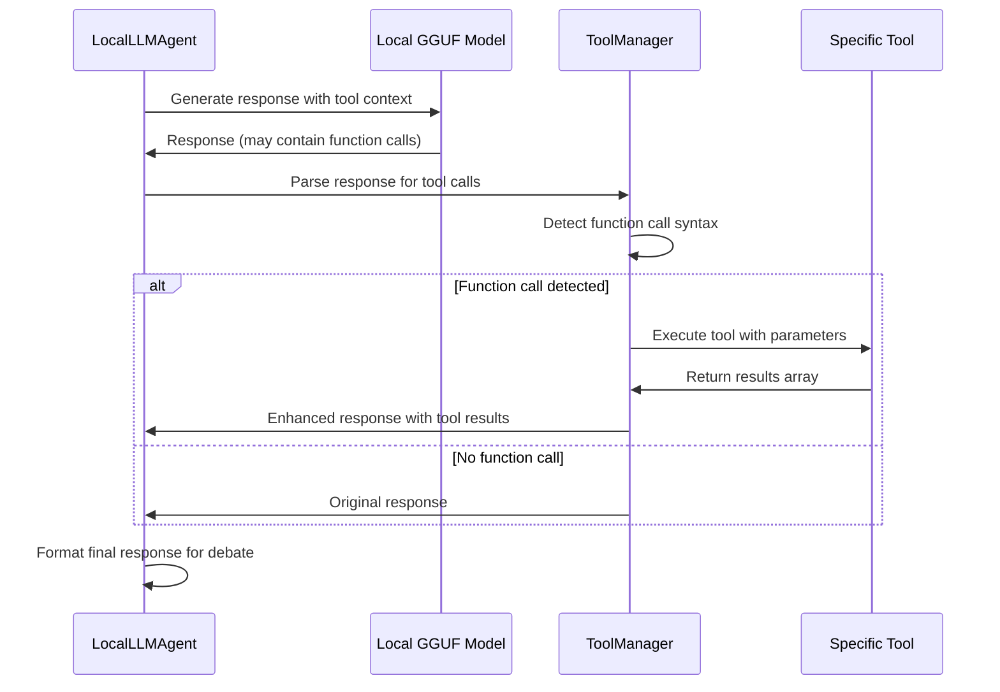

# Tool Framework Implementation Plan

## Overview
Implementation plan for adding function calling tools to the AI Debate Arena project, allowing agents to use tools during debates to enhance their arguments with real-time information.

## Current Architecture Analysis

Your project uses:
- **AutoGen** for multi-agent conversations
- **Local GGUF models** via llama-cpp-python
- **Custom LocalLLMAgent** class extending AutoGen's ConversableAgent
- **Personality-based agents** with distinct roles and colors

## Proposed Tool Framework Architecture



## Implementation Components

### 1. Base Tool Framework (`src/tools/`)

**File Structure:**
```
src/tools/
├── __init__.py
├── base_tool.py          # Abstract base class for all tools
├── tool_manager.py       # Manages tool registration and execution
├── tool_registry.py      # Registry for available tools
├── response_parser.py    # Parses LLM responses for function calls
└── builtin_tools/
    ├── __init__.py
    ├── test_tool.py      # Your requested test tool
    └── example_tools.py  # Additional example tools
```

### 2. Tool Integration Flow



### 3. Core Components Design

#### BaseTool Abstract Class
```python
class BaseTool:
    def __init__(self, name: str, description: str)
    def execute(self, **kwargs) -> List[str]  # Returns array of strings
    def get_schema(self) -> Dict  # Tool schema for LLM
    def validate_params(self, **kwargs) -> bool
```

#### ToolManager
```python
class ToolManager:
    def register_tool(self, tool: BaseTool)
    def get_available_tools(self) -> Dict[str, BaseTool]
    def execute_tool(self, tool_name: str, **kwargs) -> List[str]
    def parse_function_calls(self, response: str) -> List[Dict]
    def enhance_response_with_tools(self, response: str) -> str
```

#### TestTool Implementation
```python
class TestTool(BaseTool):
    def execute(self, query: str = "") -> List[str]:
        return [
            f"Test result 1 for query: {query}",
            f"Test result 2 for query: {query}",
            "Additional test information"
        ]
```

### 4. Agent Integration Strategy

#### Modified LocalLLMAgent
- Add tool context to system messages
- Integrate ToolManager into response generation
- Parse responses for function calls before returning
- Format tool results into natural language

#### Function Call Syntax
Agents will use a simple, parseable syntax:
```
TOOL_CALL: tool_name(param1="value1", param2="value2")
```

### 5. Configuration Integration

#### Enhanced Agent Personalities
Each agent personality will include tool preferences:
```python
AGENT_PERSONALITIES = {
    "skeptic": {
        "name": "Sam the Skeptic",
        "personality": "...",
        "preferred_tools": ["fact_check", "test_tool"],
        "tool_usage_style": "verification_focused"
    }
}
```

#### Tool Configuration
```python
TOOL_CONFIG = {
    "enabled": True,
    "max_tool_calls_per_response": 2,
    "tool_timeout": 10,  # seconds
    "fallback_on_error": True
}
```

### 6. Implementation Steps

1. **Create Base Framework** (`src/tools/base_tool.py`, `tool_manager.py`)
2. **Implement Test Tool** (`src/tools/builtin_tools/test_tool.py`)
3. **Integrate with LocalLLMAgent** (modify `src/agents.py`)
4. **Add Tool Context to System Messages** (modify `src/config.py`)
5. **Create Response Parser** (`src/tools/response_parser.py`)
6. **Add Configuration Options** (extend `src/config.py`)
7. **Update CLI Interface** (modify `src/main.py` for tool status)

### 7. Example Usage Flow

```python
# Agent receives: "Should we invest in renewable energy?"
# Agent thinks: "I need current data on renewable energy"
# Agent generates: "TOOL_CALL: test_tool(query='renewable energy statistics')"
# Tool returns: ["Renewable energy grew 12% in 2023", "Solar costs dropped 15%"]
# Agent incorporates: "Based on recent data showing renewable energy grew 12% in 2023..."
```

### 8. Extension Points for Future Development

- **Web Search Tool**: Integration with search APIs
- **Fact Checking Tool**: Integration with fact-checking services  
- **Data Retrieval Tool**: Access to statistical databases
- **News Tool**: Current events and news retrieval
- **Academic Tool**: Research paper and citation lookup

### 9. Error Handling & Fallbacks

- Tool execution timeouts
- Network failure handling
- Invalid parameter validation
- Graceful degradation when tools fail
- Logging and debugging capabilities

### 10. Testing Strategy

- Unit tests for each tool
- Integration tests with agents
- Mock tool responses for consistent testing
- Performance testing with tool calls
- Debate quality assessment with/without tools

## Benefits of This Approach

1. **Extensible**: Easy to add new tools by extending BaseTool
2. **Configurable**: Tools can be enabled/disabled per agent or globally
3. **Maintainable**: Clear separation of concerns
4. **Testable**: Each component can be tested independently
5. **Flexible**: Supports various tool types and response formats
6. **Backward Compatible**: Existing debates work without tools

## Files to Create/Modify

### New Files:
- `src/tools/__init__.py`
- `src/tools/base_tool.py`
- `src/tools/tool_manager.py`
- `src/tools/response_parser.py`
- `src/tools/builtin_tools/__init__.py`
- `src/tools/builtin_tools/test_tool.py`

### Modified Files:
- `src/agents.py` - Add tool integration to LocalLLMAgent
- `src/config.py` - Add tool configuration and enhanced system messages

## Implementation Priority

1. **Phase 1**: Core framework (BaseTool, ToolManager, TestTool)
2. **Phase 2**: Agent integration and response parsing
3. **Phase 3**: Configuration and system message updates
4. **Phase 4**: Testing and refinement

This framework provides a solid foundation for extending your debate system with function calling capabilities while maintaining the existing architecture and allowing for easy future expansion.


set CMAKE_ARGS="-DLLAMA_CUBLAS=on" && set FORCE_CMAKE=1 && pip install --no-cache-dir llama-cpp-python==0.2.90 --extra-index-url https://abetlen.github.io/llama-cpp-python/whl/cu123